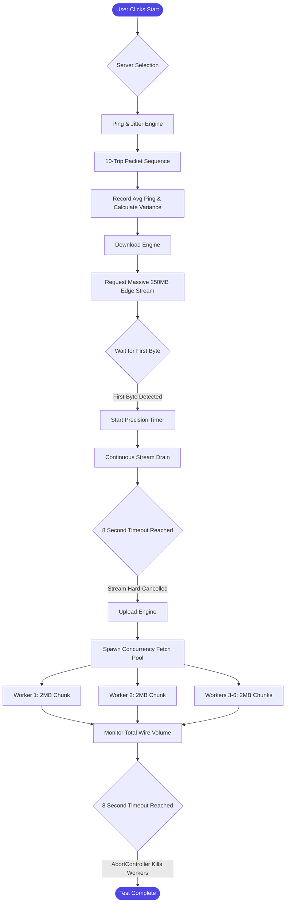

# SPEEDOMETX ⚡


A premium, highly-accurate, web-based internet speedometer built with Next.js and Framer Motion. 
Crafted with precision by [anmolmalhan](https://www.instagram.com/anmolmalhan).

## 🚀 Key Features

*   **True WAN Precision**: Operates across actual edge network endpoints to give raw internet telemetry, bypassing any local loopback bottlenecks.
*   **Micro-Latency Elimination**: Tracks Time-To-First-Byte independently so that standard ping delays don't mathematically drag down your true bandwidth average.
*   **High-Concurrency Upload Engine**: Uses an intelligent pool of parallel HTTP workers to fully saturate your TCP stack, accurately measuring upload connection speeds up to gigabit levels (bypassing XHR OS-level buffering flaws).
*   **Beautiful UX/UI**: Implements incredibly smooth, responsive animated dials and interface transitions via Framer Motion.
*   **Dark Mode Support**: Deep native dark mode integration with system-coupled preference toggling.

---

## 🧠 System Architecture & Flow

Here is a visual map of how SPEEDOMETX mathematically analyzes your internet under the hood:



---

## 💻 Technical Stack

*   **Framework**: [Next.js](https://nextjs.org/) (React)
*   **Typing**: TypeScript
*   **Styling**: TailwindCSS
*   **Animations**: Framer Motion
*   **Icons**: Lucide React
*   **Metrics**: Vercel Analytics

---

## 🛠️ Local Development

Clone the repository and set it up locally:

```bash
# Install dependencies
npm install

# Start the development server
npm run dev
```

Open [http://localhost:3000](http://localhost:3000) with your browser to launch the speedometer!
